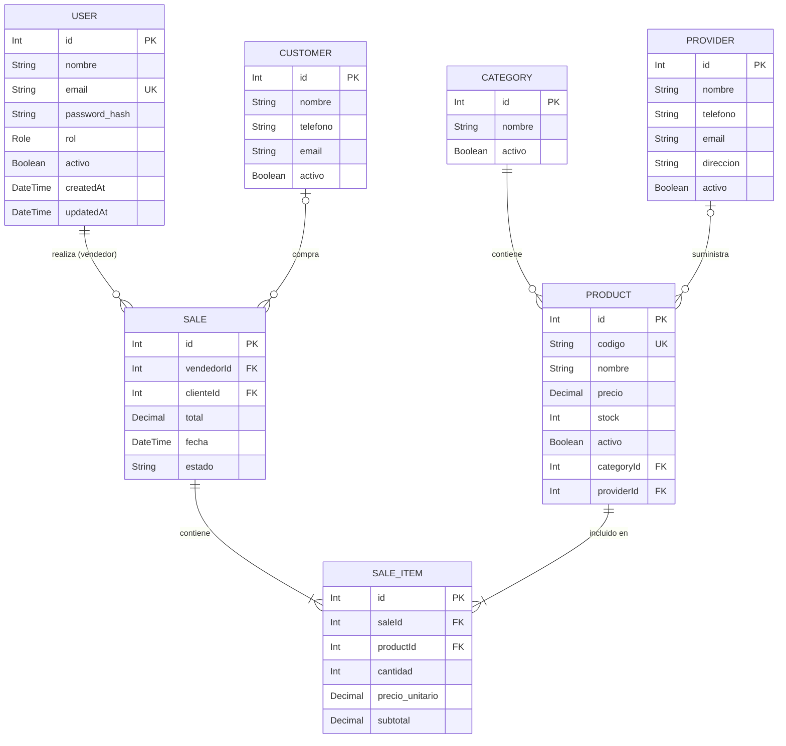

<p align="center">
  
</p>

# Sistema POS - MiniProyecto 1

Este es el **MiniProyecto 1** de la materia **Procesos y Diseño de Software**.

## Integrantes
- **Brayan Zuluaga**
- **Esteban Muñoz**
- **Isabela Gutierrez**
- **Sebastian Izquierdo**

## Descripción del Proyecto
El sistema es un punto de venta (POS) en línea que permite la gestión de inventario, ventas, clientes y reportes. Esta primera entrega se enfoca en la infraestructura de base de datos, autenticación y gestión básica de productos.

## Tecnologías Utilizadas

### Frontend: React + Vite
- **Por qué:** Se eligió **React** por su arquitectura basada en componentes, lo que facilita la creación de interfaces de usuario modulares y reutilizables. **Vite** se utiliza como herramienta de construcción por su velocidad extremadamente rápida en desarrollo y su eficiencia al generar el bundle de producción, optimizando la experiencia del desarrollador y el rendimiento final.

### Backend: NestJS
- **Por qué:** **NestJS** es un framework de Node.js robusto y escalable que utiliza TypeScript por defecto. Se seleccionó porque promueve el uso de patrones de diseño sólidos (como Inyección de Dependencias) y principios SOLID, lo que garantiza un código limpio, fácil de mantener y probar a medida que el sistema POS crece.

### Base de Datos & ORM: PostgreSQL + Prisma
- **Por qué:** **PostgreSQL** es un motor de base de datos relacional altamente confiable para manejar transacciones de ventas. **Prisma** se integra perfectamente con NestJS para ofrecer un acceso a datos con seguridad de tipos (Type-safe), facilitando las migraciones y el modelado de la base de datos.

## Modelo de Base de Datos
A continuación se presenta el diagrama de entidad-relación del sistema:




## Documentación Técnica
- [Guía de Base de Datos (Docker / Prisma)](GUIABASEDEDATOS.md)
- [Registro de Librerías](LIBRERIAS.md)

## Requisitos
- Docker Desktop
- Node.js & npm

## Pasos para iniciar el proyecto

Siga estos pasos en orden para configurar y ejecutar el sistema localmente:

### 1. Base de Datos
Primero, configure la base de datos siguiendo las instrucciones detalladas en la **[Guía de Base de Datos](GUIABASEDEDATOS.md)**. Esto incluye levantar el contenedor de Docker, correr las migraciones y el seed.

### 2. Instalación de Dependencias
Instale los paquetes necesarios tanto para el backend como para el frontend:

```powershell
# En la carpeta raíz
cd back
npm install
cd ../front
npm install
```

### 3. Ejecución de los Servidores
Abra dos terminales independientes y ejecute los siguientes comandos:

**Backend:**
```powershell
cd back
npm run start:dev
```

**Frontend:**
```powershell
cd front
npm run dev
```

---

## Flujo de Trabajo y Recomendaciones

Para mantener el proyecto organizado y evitar conflictos, se recomienda seguir estas pautas:

### 1. Sincronización de Ramas
Antes de comenzar a trabajar en cualquier nueva funcionalidad o corrección:
- **Siempre** asegúrese de estar en su rama de trabajo.
- Realice un `pull` de la rama `dev` para tener los últimos cambios integrados:
  ```powershell
  git pull origin dev
  ```

### 2. Gestión de Ramas
- No trabaje directamente sobre `main` o `dev`.

### 3. Commits y Mensajes
- Realice commits frecuentes con mensajes clarosl (ej. `feat: agregar modelo de cliente`, `fix: corregir error en login`).

### 4. Base de Datos
- Si realiza cambios en el archivo `schema.prisma`, recuerde ejecutar `npx prisma migrate dev` para aplicar los cambios localmente y notificar al equipo, ya que esto generará una nueva carpeta de migración que debe subirse al repo. *En la medida de lo posible, Brayan será el encargado de ejecutar cualquier cambio en la base de datos.*
